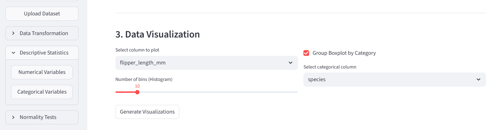
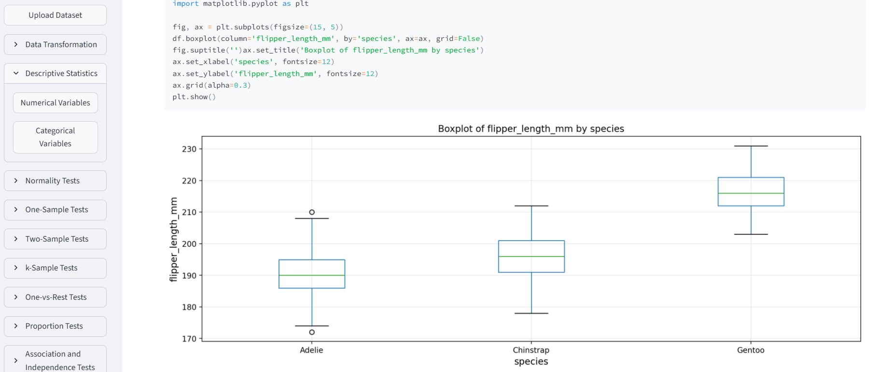
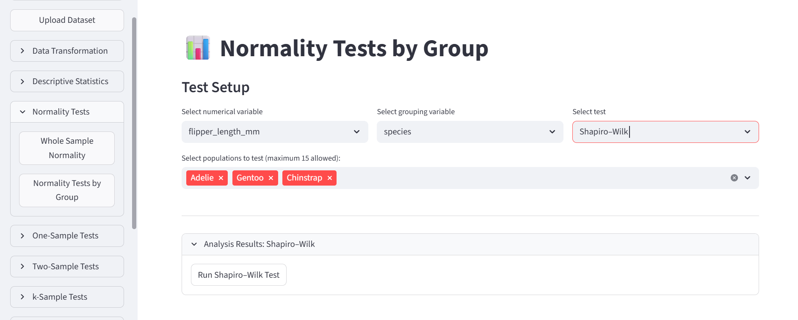
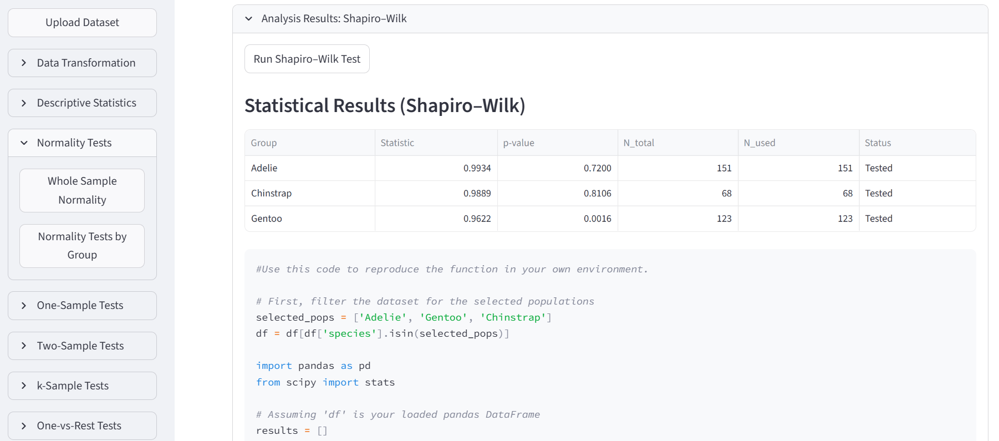
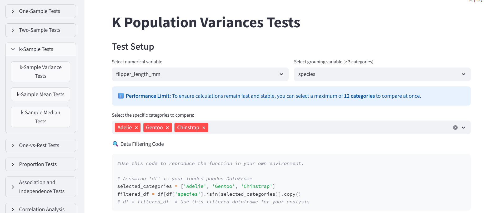
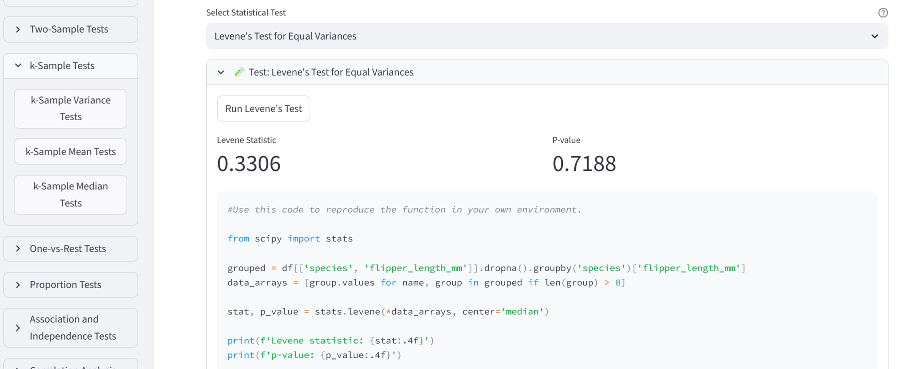
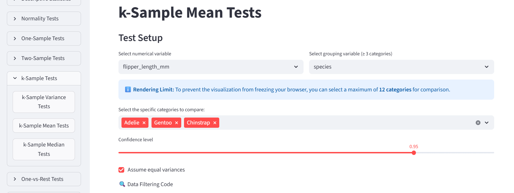
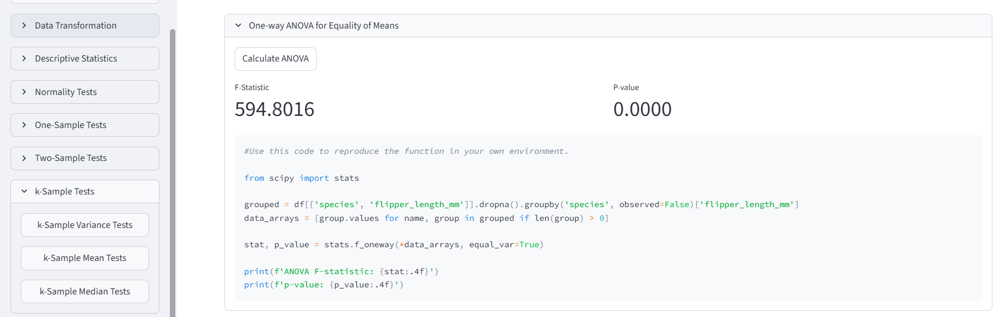
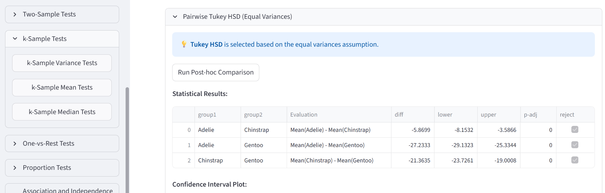
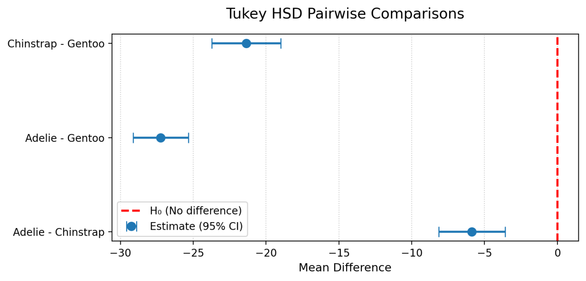

::: {.content-visible when-format="html"}
::: {.download-bar}
[Descargar esto en PDF](descargas/01_Pinguinos.pdf){.btn .btn-primary download="01_Pinguinos.pdf"}
:::
:::

## Presentación del escenario

**¿La longitud media de las aletas es igual 
en las tres especies de pingüinos?** 
Usaremos ANOVA para comparar sus medias 
y veremos el código Python que genera el software.

Necesitas la aplicación abierta y el CSV de pingüinos de la carpeta `data`. 

## 1. Carga de datos

1. En **Upload Dataset**, carga el archivo de pingüinos: `penguins.csv`.
2. Verifica que la vista previa muestre las columnas separadas correctamente.
3. En el menú **Descriptive Statistics** selecciona **Numerical Variables** y
selecciona `flipper_length_mm` (longitud de aleta, en milímetros) como variable.
4. En la parte baja, activa **Group Boxplot by Category**, 
elige `species` y pulsa **Generate Visualizations**.
Esto genera un gráfico de cajas que muestra la distribución de la longitud de aleta por especie.

{#fig-p-cajas-ajustes width=90%}

{#fig-p-cajas width=100%}

Gentoo presenta aletas más largas en este gráfico. 
Queremos saber si hay evidencia suficiente para
descartar la hipótesis de igualdad de **medias**.
La herramienta para realizar este análisis 
es el test de una vía (ANOVA).

::: {.callout-note title="Antes del test"}
El ANOVA clásico se usa con observaciones independientes,
distribuciones aproximadamente normales dentro de los grupos 
y varianzas similares. 
Fijaremos un nivel de significación de **0,05** 
y revisaremos normalidad y varianzas antes de comparar medias.
:::

## 2. Revisar la normalidad por especie

Es importante revisar normalidad y varianzas antes de comparar medias
porque sin estas condiciones el ANOVA clásico puede no ser fiable.

Abre **Normality Tests → Normality Tests by Group**:

1. Selecciona `flipper_length_mm` como variable numérica.
2. Elige `species` para agrupar e incluye las tres especies.
3. Selecciona **Shapiro–Wilk** y pulsa **Run Shapiro-Wilk Test**.

{#fig-p-normalidad-ajustes width=90%}

{#fig-p-normalidad width=85%}

La hipótesis nula de esta prueba es que la distribución del grupo es normal. 
Con $\mathbf{p < 0,05}$ encontramos evidencia contra la normalidad;
con $\mathbf{p ≥ 0,05}$ no la rechazamos, pero tampoco la demostramos.

En la captura, 
los valores p son **0,7200** para Adelie, 
**0,8106** para Chinstrap y **0,0016** para Gentoo. 
Gentoo requiere atención: revisa su forma, 
valores extremos y 
un gráfico Q–Q.

::: {.callout-note title="¿Por qué seguimos? El teorema del límite central"}
Con observaciones independientes de una misma distribución y varianza finita, 
el **teorema del límite central (TLC)** 
indica que la distribución de la media muestral se aproxima a una normal 
al aumentar el tamaño de muestra. 
Los datos individuales no tienen que volverse normales.

Aquí tenemos **151, 68 y 123 casos válidos por especie**: 
todos superan la referencia habitual de **30 por grupo**. 
Esto apoya continuar con una comparación de medias 
pese al resultado para Gentoo. 
El 30 es una regla orientativa, 
no un umbral del teorema; 
con asimetría marcada o valores extremos pueden hacer falta más observaciones.
:::

**La decisión en este ejemplo:** 
continuamos con ANOVA apoyándonos en los tamaños de la muestra por especie. 

[Más sobre el TLC](https://online.stat.psu.edu/stat414/Lesson27).

**Mira el código:** identifica la selección de grupos y la llamada a `shapiro`.

## 3. Comparación de varianzas por especie

1. Abre **k-Sample Tests → k-Sample Variance Tests**. 
2. Selecciona otra vez `flipper_length_mm` como variable numérica,
`species` para agrupar y elige las tres especies. 
3. Elige **Levene's Test for Equal Variances** y ejecuta la prueba.

{#fig-p-varianzas-ajustes width=90%}

{#fig-p-varianzas width=100%}

La hipótesis nula es que las varianzas de los grupos son iguales. 
En este ejemplo, **p = 0,7188**: 
no encontramos evidencia suficiente para rechazarla al nivel 0,05. 
Eso no demuestra que las varianzas sean idénticas,
pero nos permite continuar con el ANOVA.

**Mira el código:** localiza `stats.levene`. 
En la captura se utiliza `center='median'`, 
una variante menos sensible a desviaciones de normalidad.

## 4. Comparar las medias

Abre **k-Sample Tests → k-Sample Mean Tests** y selecciona:

- Variable numérica: `flipper_length_mm`.
- Agrupación: `species`; incluye las tres especies.
- Confianza: **0.95** (95% para los intervalos de confianza).
- **Assume equal variances**: activado para este ejemplo 
(el test anterior no rechazó la hipótesis de igualdad de varianzas).

Ejecuta el ANOVA. 
La hipótesis nula es que las tres medias son iguales.

{#fig-p-anova-ajustes width=90%}

{#fig-p-anova width=100%}

En el ejemplo, $\mathbf{F \approx 594,80}$ y la pantalla muestra `p = 0.0000`. 
Léelo como **p < 0,001**, no como cero exacto. 
Hay evidencia suficiente para descatar que las medias
de los grupos son iguales, existe por lo menos
una media que se diferencia significativamente.

::: {.callout-tip title="Mira el código Python"}
Localiza `stats.f_oneway`: realiza el ANOVA clásico.
:::

## 5. Intervalos de confianza y comparaciones por pares

**Tukey HSD** es la opción para obtener intervalos de confianza
cuando se asume igualdad de varianzas.
Con una confianza de **0.95**,
mira los intervalos de las diferencias de medias: 
si un intervalo no incluye cero, 
ese par presenta una diferencia significativa. 

{#fig-p-tukey-ajustes width=90%}

{#fig-p-tukey width=75%}

En la figura ningún intervalo cruza cero. 
Una diferencia negativa «Adelie − Gentoo» indica una media menor en Adelie. 

**Para el aprendizaje:** 
Explica la secuencia **gráfico de cajas → normalidad → varianzas → ANOVA → Tukey** 
y una limitación del análisis.

[Más sobre ANOVA en SciPy](https://docs.scipy.org/doc/scipy/reference/generated/scipy.stats.f_oneway.html).

