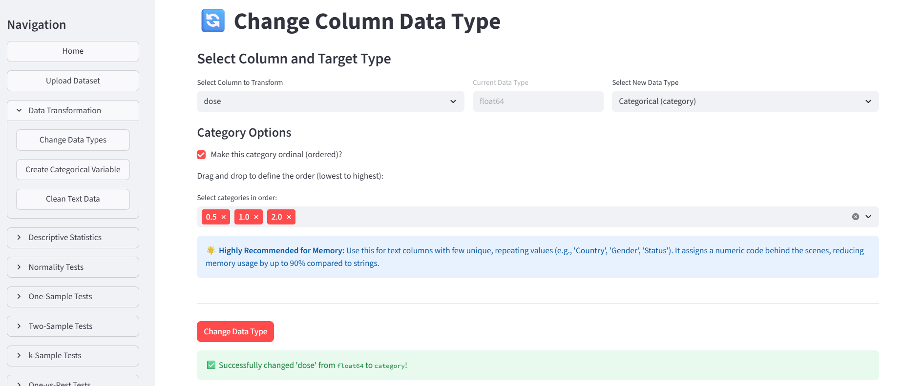
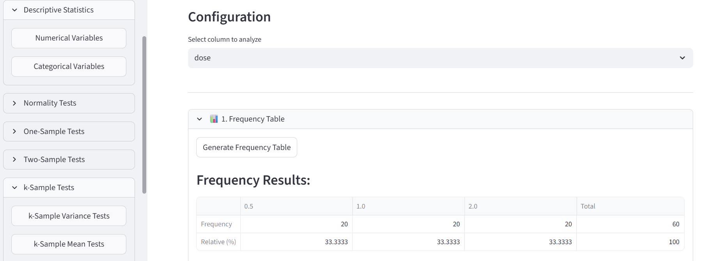
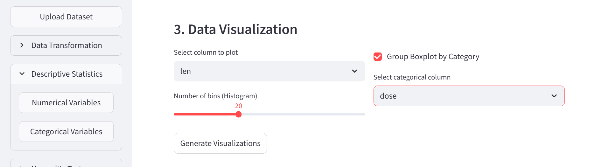
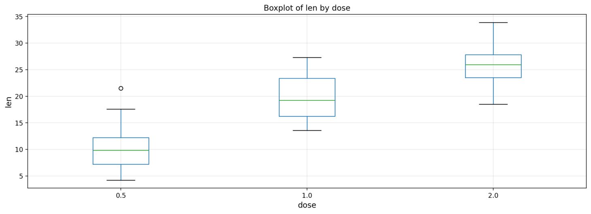
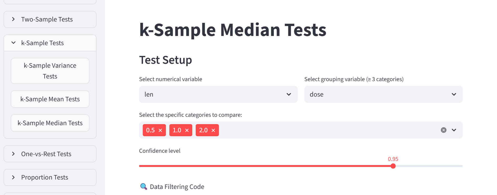
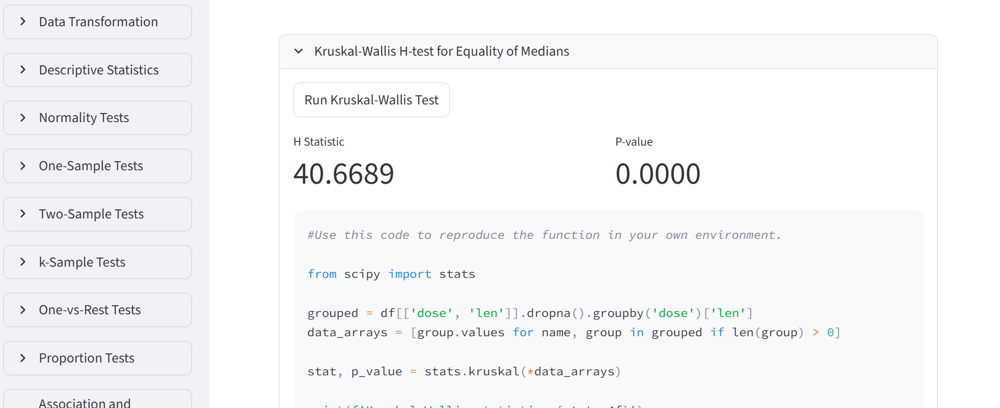
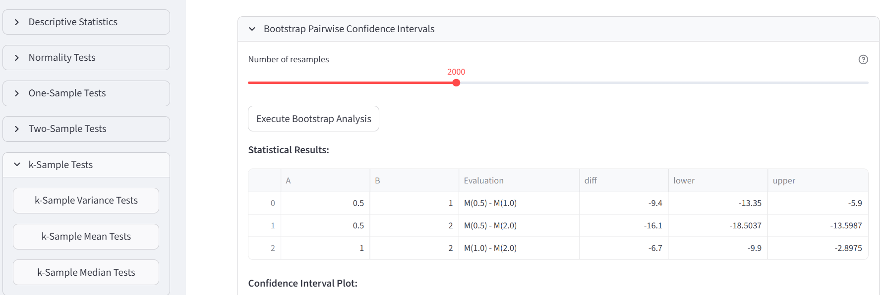
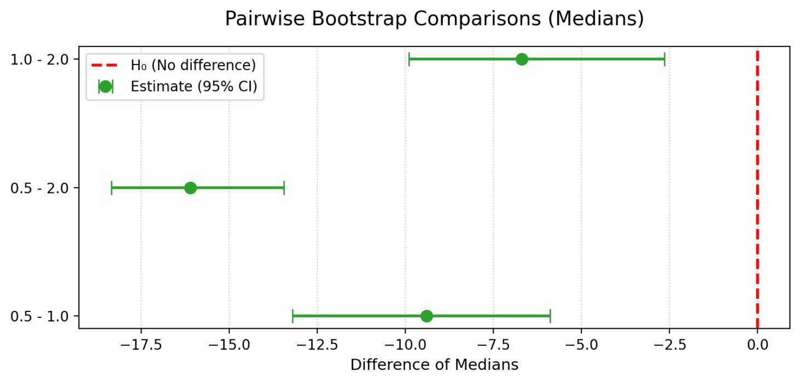

::: {.content-visible when-format="html"}
::: {.download-bar}
[Descargar esto en PDF](descargas/02_Dientes.pdf){.btn .btn-primary download="02_Dientes.pdf"}
:::
:::

## Presentación del escenario

**¿Cambia la longitud de los odontoblastos entre tres dosis de vitamina C?** 
Usaremos `ToothGrowth`, con datos de 60 cobayas, 
para conocer una prueba basada en rangos y ver su código Python.

Este ejemplo se centra en la dosis. 
El dataset también incluye dos formas de administración de vitamina C; 
aquí las ignoramos para simplificar el recorrido.

## 1. Preparar los datos

1. Carga el CSV de `ToothGrowth` desde **Upload Dataset**.
2. En **Data Transformation → Change Data Types**, selecciona `dose` y conviértela en **Categorical (category)**. 
Esta variable es categóroca ordinal, el orden debe ser **0.5, 1.0, 2.0**.
3. En **Descriptive Statistics → Numerical Variables**, elige `len`. 
Genera un gráfico de cajas agrupado por `dose`.

{#fig-d-tipo-ajustes width=90%}

{#fig-d-frecuencias width=90%}

Comprueba también las frecuencias de `dose` en **Categorical Variables**: hay **20 animales por dosis**. 

{#fig-d-cajas-ajustes width=90%}

{#fig-d-cajas width=85%}

Las medianas parecen aumentar con la dosis. 
Ahora vamos a contrastar si hay diferencias entre los grupos
utilizando un procedimiento no paramétrico: **Kruskal–Wallis**.

::: {.callout-note title="Antes del test"}
Kruskal–Wallis compara rangos en grupos independientes y no exige normalidad. 
Cuando las formas y dispersiones son similares,
se interpreta como una comparación de medianas.
No hace falta probar Shapiro–Wilk o Levene para usarlo. 
Lo elegimos para practicar un método no paramétrico, 
no hemos descartado ANOVA necesariamente.
:::

## 2. Ejecutar Kruskal–Wallis

En **k-Sample Tests → k-Sample Median Tests**, selecciona:

- Variable numérica: `len`.
- Agrupación: `dose`.
- Categorías: **0.5, 1.0 y 2.0**.

La hipótesis nula es que los grupos tienen la misma distribución. 
Pulsa **Run Kruskal-Wallis Test** para ver los resultados y el código Python que genera la aplicación.

{#fig-d-test-ajustes width=90%}

{#fig-d-test width=100%}

En el ejemplo, $\mathbf{H \approx 40,67}$ y **p < 0,001**. 
Hay suficiente evidencia para descartar la hipótesis nula
de que las medianas son iguales.
El resultado global no dice por sí solo qué pares difieren.

Aunque el menú se llame **Median Tests**, 
recuerda que la interpretación del test depende de la forma de las distribuciones.

::: {.callout-tip title="Mira el Python que acabas de generar"}
Localiza `stats.kruskal` debajo del resultado. 
Compara ese bloque con el ANOVA del episodio anterior: 
se preparan grupos de observaciones, pero cambia la función estadística. 
:::

## 3. Intervalos de confianza por pares con bootstrap
Kruskal–Wallis no ofrece comparaciones por pares ni intervalos de confianza,
el software incluye un procedimiento mediante bootstrap:
se remuestrean los datos y se calculan las diferencias de medianas entre pares de grupos.
En **Bootstrap Pairwise Confidence Intervals**, 
conserva `len`, `dose` y las tres dosis. 
Selecciona **95 % de confianza** y **2000 remuestreos**, 
y genera los intervalos para las diferencias de medianas.

{#fig-d-bootstrap-ajustes width=90%}

{#fig-d-bootstrap width=90%}

Para **0.5 − 1.0**, la diferencia observada es **−9,4**, 
con un intervalo aproximado de **−13,35 a −5,90**. 
El primer grupo tiene una mediana menor; 
el intervalo no incluye cero. 
Los otros dos intervalos también son negativos.

::: {.callout-note title="Qué puedes concluir"}
Estos intervalos estudian diferencias de medianas, 
Kruskal–Wallis no trabaja con medianas directamente. 
Úsalos como exploración adicional. 
:::

**Para el aprendizaje** 
Recuerda que aquí ignoramos las dos formas de administración: 
este recorrido no estudia sus diferencias ni su interacción con la dosis.
Investiga cómo esta variable afecta la longitud de los odontoblastos.

[Más sobre Kruskal–Wallis en SciPy](https://docs.scipy.org/doc/scipy/reference/generated/scipy.stats.kruskal.html).

