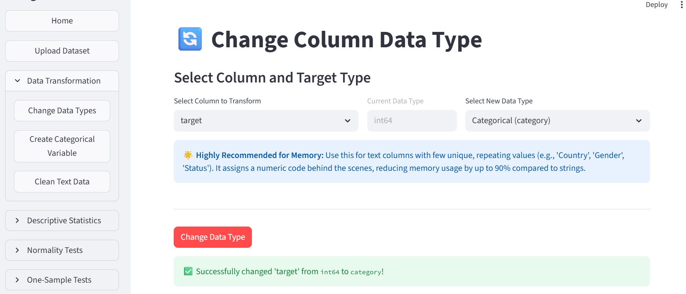
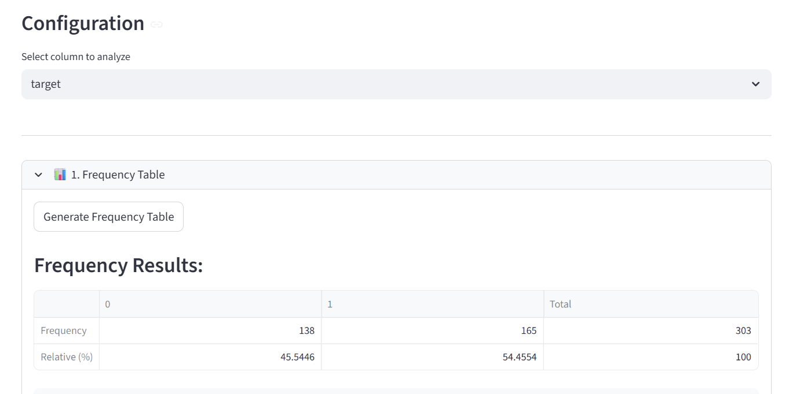
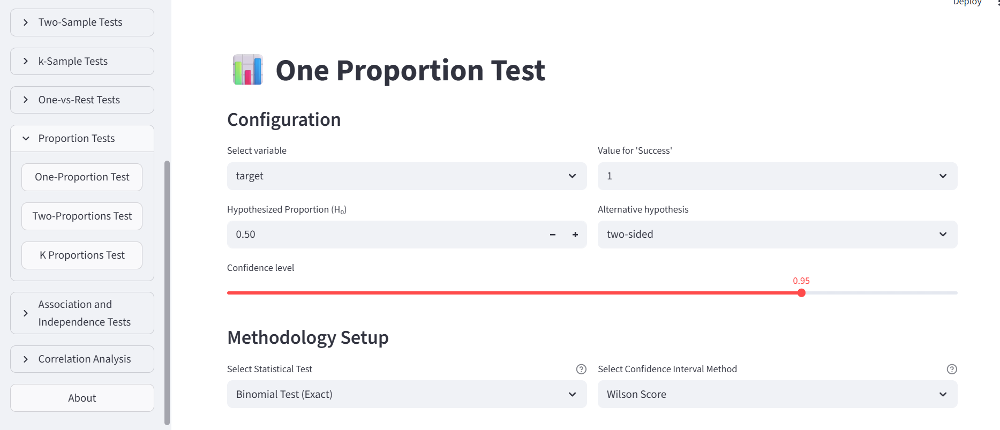
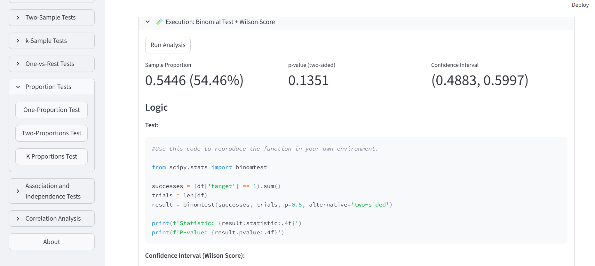
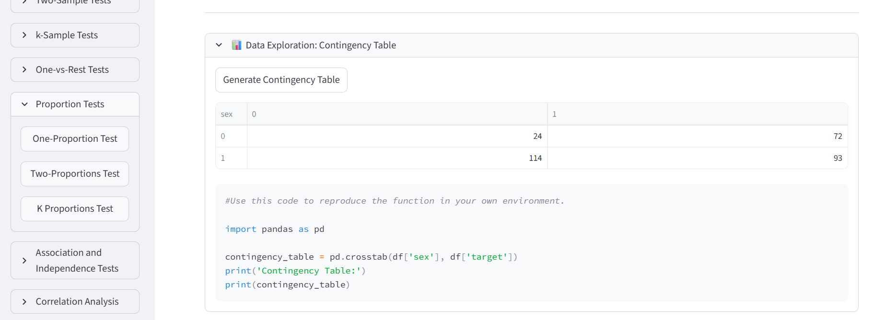
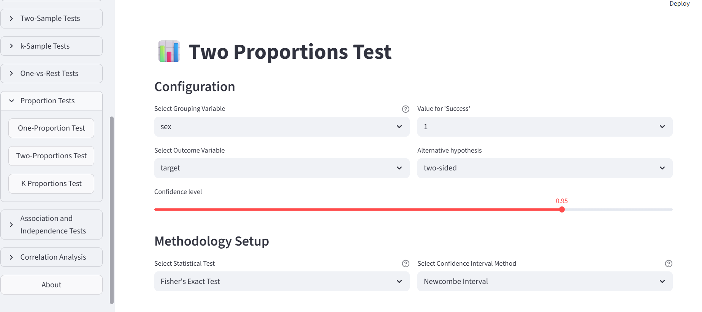
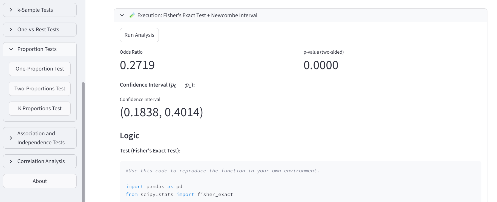

::: {.content-visible when-format="html"}
::: {.download-bar}
[Descargar esto en PDF](descargas/03_Proporciones.pdf){.btn .btn-primary download="03_Proporciones.pdf"}
:::
:::

## Presentación del escenario

**¿La proporción de personas con la enfermedad es compatible con el 50 %?** 
Usaremos el archivo `heart` para realizar una prueba binomial 
y obtener un intervalo de confianza.

En este archivo, **`target = 1` significa que la persona tiene la enfermedad** 
y **`target = 0` que no la tiene**. 
El 50 % es una referencia para practicar.

## 1. Cargar los datos

1. Carga el CSV de `heart` en **Upload Dataset**.
2. En **Data Transformation → Change Data Types**, 
convierte `target` en variable categórica.
3. En **Descriptive Statistics → Categorical Variables**, 
selecciona `target` y genera su tabla de frecuencias.

{#fig-r-tipo-ajustes width=90%}

{#fig-r-frecuencias width=80%}

En este ejemplo, **165 de 303 personas tienen la enfermedad**: 
aproximadamente **54,46 %**. 
La pregunta es si esa diferencia respecto al 50 % es estadísticamente significativa.

::: {.callout-note title="Antes del test"}
La prueba binomial trabaja con un evento binario y 
observaciones independientes, 
bajo un modelo de probabilidad común. 
No exige normalidad ni igualdad de varianzas, 
y su versión exacta puede utilizarse sin grandes muestras. 
:::

## 2. Ejecutar la prueba

En **Proportion Tests → One-Proportion Test**, configura:

- Variable: `target`; **Value for Success**: `1` (tener la enfermedad).
- Proporción de referencia: **0.5** (50%).
- Alternativa: **two-sided**, para buscar diferencias en ambos sentidos.
- Prueba: **Binomial Test (Exact)**.
- Intervalo: **Wilson Score**; confianza: **0.95**.

La hipótesis nula es que la proporción de personas con la enfermedad 
es igual a 50%. 
Pulsa **Run Analysis**. 
Aquí «success» solo nombra el evento contado; 
no significa un resultado favorable.

{#fig-r-una-ajustes width=90%}

{#fig-r-resultado width=100%}

En el ejemplo, el **valor p es 0,1351**. 
Como supera 0,05, no hay evidencia suficiente para descartar que 
la proporción de personas con la enfermedad sea igual al 50 %. 
Esto **no demuestra que sea exactamente el 50 %**.

El intervalo de Wilson va aproximadamente del **48,83 % al 59,97 %** 
e incluye el 50 %. 
La prueba binomial y el intervalo de Wilson son dos procedimientos 
distintos que aquí ofrecen lecturas compatibles.

::: {.callout-tip title="Mira el código Python que acabas de generar"}
Localiza `binomtest` bajo el resultado. 
Identifica el número de casos del evento, el total, la referencia `p=0.5` y la alternativa `two-sided`. 
Observa que ese `p=0.5` es un dato de entrada; 
no es el valor p que devuelve la prueba.
:::

## 3. Comparar la proporción entre dos grupos

Ahora la pregunta es: 
**¿es igual la proporción de personas con la enfermedad entre 
mujeres y hombres?** 
En este archivo, **`sex = 0` corresponde a mujeres** y **`sex = 1` a hombres**.
Convierte `sex` en variable categórica y revisa la tabla de contingencia `sex` × `target`.

| Grupo `sex` | Sin enfermedad (0) | Con enfermedad (1) | Total | % con enfermedad |
|:--|--:|--:|--:|--:|
| 0 (mujeres) | 24 | 72 | 96 | 75,00 % |
| 1 (hombres) | 114 | 93 | 207 | 44,93 % |

{#fig-r-contingencia width=90%}

En **Proportion Tests → Two-Proportions Test**, 
selecciona `sex` como agrupación, 
`target` como outcome y **1** como success. 
Elige **two-sided**, **Fisher's Exact Test** y un intervalo **Newcombe** 
con confianza **0.95**. Ejecuta el análisis.

{#fig-r-dos-ajustes width=90%}

La hipótesis nula es que las dos proporciones son iguales. 
Fisher es una opción exacta para la tabla 2 × 2 
y no exige recuentos esperados grandes. 
Si eliges una chi-cuadrado, 
revisa antes los recuentos esperados y las condiciones de ese método.

{#fig-r-dos width=55%}

El resultado muestra **p < 0,001**. 
La diferencia **mujeres − hombres (0 − 1)** es **30,07 puntos porcentuales**, 
con un intervalo aproximado de **18,38 a 40,14 puntos**. 
El intervalo no incluye cero: 
en este archivo la proporción de personas con la enfermedad es mayor entre las mujeres. 
Esto no establece una relación causal.

La captura también presenta el *odds ratio*. 
Es otra medida, 
no la confundas con la diferencia de proporciones. 
Para la diferencia, 
la referencia de igualdad es **0**; 
para el *odds ratio*, es **1**.

**En el código Python**, 
localiza `fisher_exact`, 
comprueba el orden de la tabla y encuentra el cálculo del intervalo.

**Para el aprendizaje** 
Cambia solo el nivel de confianza y observa qué pasa con la amplitud del intervalo y qué parte del código cambia.

[Más sobre la prueba binomial en SciPy](https://docs.scipy.org/doc/scipy/reference/generated/scipy.stats.binomtest.html).

