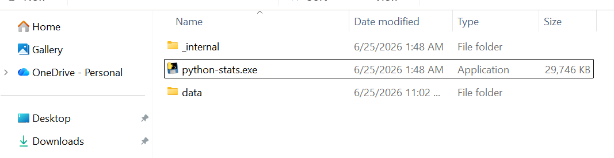
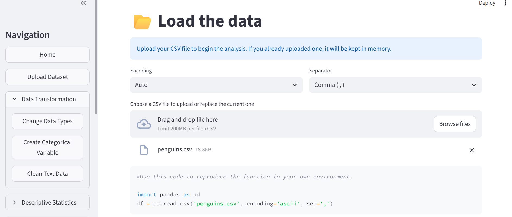

::: {.content-visible when-format="html"}
::: {.download-bar}
[Descargar esto en PDF](descargas/Guia_inicial.pdf){.btn .btn-primary download="Guia_inicial.pdf"}
:::
:::

## Propósito del proyecto

Esta aplicación está pensada para acompañar las clases de estadística inferencial
para cursos universitarios en carreras como ciencias de datos. 
El proyecto nació porque hay cursos de estadística inferencial que se apoyan en R,
pero los estudiantes de carreras técnicas suelen aprender Python como lenguaje de programación.
Utilizar R resulta sencillo a través de Rcommander, así que este proyecto
usa esta herramienta como inspiración.

La idea es que el practicante pueda utilizar las herramientas
de estadística inferencial a través de una interfaz gráflica:
apuntar y hacer clic, pero que también sea transparente acerca
del código Python que se ejecuta en segundo plano.

El usuario puede cargar un archivo csv, 
realizar un procedimiento estadístico y copiar 
el código en Python que se despliega en pantalla
para crear su propio pipeline de análisis
en su entorno local o en un notebook.

## 1. Descarga y ejecución

Abre la [página de descargas del proyecto](https://github.com/danielTeniente/python-statistical-inference/releases) 
y busca el archivo **python-stats.zip**.

1. Descarga y extrae el ZIP en una carpeta.
2. Mantén juntos el ejecutable y la carpeta `_internal` para que el programa funcione.
La carpeta 'data' contiene 3 datasets de ejemplo para probar el software.
3. El archivo **python-stats.exe** abre la aplicación en el navegador.

{#fig-g-paquete width=100%}

El ejecutable incluye lo necesario para abrir la aplicación sin instalar Python por separado. 
Al iniciarlo se abre una consola y la interfaz aparece en el navegador.
Para detener la aplicación se puede cerrar la consola o presionar `Ctrl+C` en ella.

::: {.callout-tip title="Deja abierta la consola"}
La consola mantiene el programa en marcha. 
Si el navegador no se abre, entra en la dirección local que muestra la CLI, 
normalmente `http://localhost:8501`. 
Cuando termines, puedes cerrar la consola. 
:::



## 2. Cargar datos

En **Upload Dataset** puedes seleccionar un archivo CSV de tu computadora.
Revisa que la vista previa muestre las columnas separadas correctamente. 
Si todo aparece en una sola columna, ajusta el separador.

{#fig-g-carga width=100%}

## 3. Escenarios disponibles en la carpeta 'data'

- **01 · Pingüinos:** compara medias entre especies con ANOVA. Es el recorrido **paramétrico**.
- **02 · Dientes:** compara grupos de dosis con Kruskal–Wallis. Es el recorrido **no paramétrico**.
- **03 · Proporciones:** cuenta un evento y contrasta una proporción con la prueba binomial.

## 4. Utilizar el código Python

Revisa el bloque Python que aparece junto a cada resultado. 
Cópialo a tu cuaderno (en Google Colab) 
y construye tu propio pipeline.

Para ejecutarlo en tu entorno local,
instala las bibliotecas necesarias.
Es recomendable crear un venv
utilizando `python -m venv venv` y activarlo con `venv\Scripts\activate` (Windows)
o `source venv/bin/activate` (Linux/Mac).

## 5. Es sólo un apoyo para el aprendizaje
La aplicación facilita el cálculo; 
elegir el método adecuado e interpretar el resultado forman parte del aprendizaje. 

